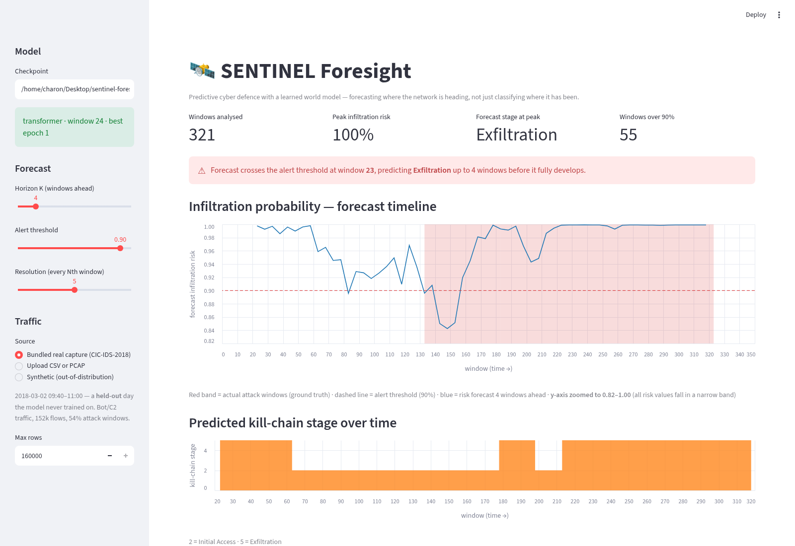

# SENTINEL Foresight
### A World Model for Predictive Cyber Defence — SIH 2026 · PS 26153

Most intrusion detectors classify each network flow in isolation as benign or
malicious, discarding the *temporal, causal structure* of an attack. **Foresight**
instead learns a **world model** of the network — the state-transition dynamics
`P(S_t+1 | S_t)` — and rolls it forward K steps to forecast attacker progression
**before the kill chain completes.**

> **Read [`PROJECT_CONTEXT.md`](PROJECT_CONTEXT.md) for the full picture** — the
> concept, architecture, measured results, known limitations, and how to pick the
> work back up. This README is the short version.

---

## Status — what is actually built

| Component | State |
|---|---|
| Feature pipeline + 22-feature network state `S_t` | ✅ built |
| CIC-IDS-2018 loader (hardened against real-world quirks) | ✅ built |
| World model — Transformer/LSTM, next-state + stage heads | ✅ built |
| K-step rollout / forecast timeline | ✅ built |
| Training pipeline (trained on all 10 days, 4M flows) | ✅ trained |
| Explainability — integrated gradients + attention | ✅ built |
| Benchmark vs persistence / logistic-regression / majority | ✅ built |
| Offline Streamlit demo (bundled real capture) | ✅ built |
| Presentation runbook ([`PRESENTING.md`](PRESENTING.md)) | ✅ built |
| Out-of-distribution input guard | ✅ built |
| PCAP ingest (scapy → flows, CICFlowMeter-compatible) | ✅ built |
| Regression tests (`tests/`) | ✅ built |
| Slides / demo video / screenshots | ❌ not started |



*Forecast timeline on a held-out capture. Blue = risk forecast 4 windows
ahead; red band = actual attack windows; dashed = alert threshold.*

---

## Measured results

Trained on 4M flows from CIC-IDS-2018; validation is the **last 3 capture days**,
held out temporally (never a random split). Raw numbers: `benchmark/results_ws15.json` (shipped model; `results.json` is the previous 1-second model).

**Dynamics — did it learn `P(S_t+1 | S_t)`?**

| | next-state MSE |
|---|---|
| Persistence baseline (`S_t+1 = S_t`) | 0.302 |
| **World model** | **0.227 (−24.7%)** |

This is the result that earns the name "world model": it predicts the network's
next state materially better than assuming nothing changes.

**Detection — infiltration windows (28.6% prevalence)**

| model | precision | recall | F1 | FPR | AUC |
|---|---|---|---|---|---|
| Majority (always benign) | 0.000 | 0.000 | 0.000 | 0.0000 | n/a |
| Best single raw feature (`n_flows`) | 0.826 | 0.124 | 0.216 | 0.0105 | 0.825 |
| Logistic regression (same features) | 0.295 | 0.272 | 0.283 | 0.2596 | 0.585 |
| **World model** | 0.444 | 0.936 | **0.602** | 0.4693 | **0.876** |

**Read that FPR before quoting the F1.** At the default 0.5 threshold the model
is tuned for recall and fires on 47% of benign windows — fine for triage,
unusable for auto-blocking. Thresholds should be picked for the deployment, on
training data. Picking for FPR ≤ 1% on train gives, on val:
**precision 0.771, recall 0.279, F1 0.410, FPR 3.3%.**

Against the strongest trivial baseline (one raw feature) the honest margin is
**AUC 0.876 vs 0.825**. Against logistic regression the F1 gap looks enormous;
that flatters us, because that baseline sits badly against a fixed threshold.

### Per-day breakdown — forecast AUC on held-out days

Aggregate F1 hides a large capability split. Forecast AUC per held-out day:

| day | attack type | 360 s context (shipped) | 16 s context (previous) |
|---|---|---|---|
| 2018-03-02 | Bot / C2 | **0.970** | 0.894 |
| 2018-02-28 | Infiltration | **0.872** | 0.715 |
| 2018-03-01 | Infiltration | **0.818** | **0.466** |
| *pooled* | | **0.857** | 0.800 |

**The Infiltration failure was diagnosed and fixed.** The earlier model was
*below chance* on 03-01 — attack windows scored lower risk than benign ones.
Per-feature analysis showed the signal was there but needed a coarser window
(single-feature separability rose from 0.723 at 1 s to 0.781 at 60 s):
Infiltration is slow, low-volume traffic from an already-trusted host, and a
one-second window cannot distinguish it. Widening the state window from 16 s to
**6 minutes** raised Infiltration AUC from 0.466 to 0.818, and improved every
other day too.

**Be careful what you claim from this.** At *matched* operating points (FPR ≈ 1%)
the two models score almost the same pooled F1 (0.410 vs 0.408). The real,
defensible gain is in **ranking and coverage** — better AUC on all three days,
and an entire attack class going from undetectable to detected — not a jump in
the headline F1, which moved mostly because the fixed 0.5 threshold sits at a
different place on the new model's curve.

---

## Quick start

```bash
git clone <this repo> && cd sentinel-foresight

# CPU-only torch keeps the install small
python3 -m venv .venv
.venv/bin/pip install --index-url https://download.pytorch.org/whl/cpu torch
.venv/bin/pip install streamlit pandas numpy scikit-learn scapy

.venv/bin/streamlit run demo/app.py          # demo
.venv/bin/python tests/test_pcap_ingest.py   # tests (no pytest needed)
.venv/bin/python tests/test_demo_smoke.py
```

The demo accepts a **CICFlowMeter CSV or a raw PCAP** (reassembled to flows
locally with scapy, following CICFlowMeter's feature definitions so the model
sees what it was trained on).

The demo bundles a real 80-minute slice of held-out CIC-IDS-2018 traffic
(`demo/sample_capture.csv.gz`, 1.9 MB), so it runs with **no dataset download**.
It needs a checkpoint at `checkpoints/world_model_best.pt` — see
`training/README.md` to train one, or `PROJECT_CONTEXT.md` for the exact command.

---

## Layout

```
foresight/
  features/   flow + packet feature extraction  (ported from SENTINEL)
  data/       state.py (S_t definition) · cicids.py (CSV) · pcap.py (PCAP) · drift.py (OOD guard) · synth.py
  model/      world_model.py — P(S_t+1 | S_t), next-state + stage heads
  rollout/    K-step forward simulation, batched
  explain/    integrated gradients + temporal attention
  mitre.py    kill-chain stage vocabulary + dataset-label mapping
training/     train.py — CLI trainer (best-val-F1 checkpointing)
benchmark/    baseline.py + results.json
demo/         app.py + bundled real sample capture
tests/        PCAP ingest + CSV/PCAP equivalence + demo smoke tests
checkpoints/  trained weights (gitignored)
```

## Relationship to SENTINEL

Foresight reuses SENTINEL's battle-tested feature-extraction code (flow parsing,
Kitsune-style timing stats, TCP-flag decoding, MITRE vocabulary) but is a
**distinct system**: SENTINEL is a real-time detection-and-response appliance;
Foresight is a predictive world model trained offline on datasets. Kept separate
so neither story muddies the other.
